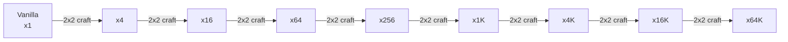

# compactxpbottles

Compact Experience Bottles is a Minecraft mod that lets you compress large amounts of bottle o' enchanting into higher-capacity variants, making XP storage and transport much easier.

Want to try the mod? Download it on [CurseForge](https://www.curseforge.com/minecraft/mc-mods/compactxpbottles).

## What the mod adds

The mod adds 8 compact bottle tiers:

- Experience Bottle x4
- Experience Bottle x16
- Experience Bottle x64
- Experience Bottle x256
- Experience Bottle x1K
- Experience Bottle x4K
- Experience Bottle x16K
- Experience Bottle x64K

Each bottle keeps the normal bottle o' enchanting behavior, but multiplies the XP dropped by its tier value.

## How XP scales

A compact bottle gives the same randomized XP as a vanilla bottle, multiplied by its tier.

- Vanilla bottle: normal XP payout
- x4 bottle: 4 vanilla bottles worth of XP
- x16 bottle: 16 vanilla bottles worth of XP
- x64K bottle: 65,536 vanilla bottles worth of XP

### XP scaling infographic



### Storage comparison infographic

| Bottle tier | Equivalent vanilla bottles | Equivalent previous tier |
| --- | ---: | ---: |
| x4 | 4 | 4x vanilla |
| x16 | 16 | 4x x4 |
| x64 | 64 | 4x x16 |
| x256 | 256 | 4x x64 |
| x1K | 1,024 | 4x x256 |
| x4K | 4,096 | 4x x1K |
| x16K | 16,384 | 4x x4K |
| x64K | 65,536 | 4x x16K |

## Crafting

Every compact bottle is crafted in a 2x2 square using 4 bottles of the previous tier:

```text
X X
X X
```

Examples:

- 4 vanilla bottles -> 1 x4 bottle
- 4 x4 bottles -> 1 x16 bottle
- 4 x16K bottles -> 1 x64K bottle

## Why use Compact Experience Bottles?

- Save storage space when stockpiling XP
- Move large amounts of XP without hauling stacks of vanilla bottles
- Keep your XP supplies organized by tier
